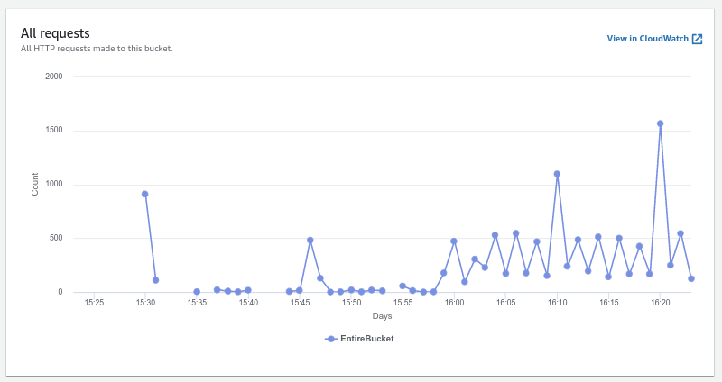
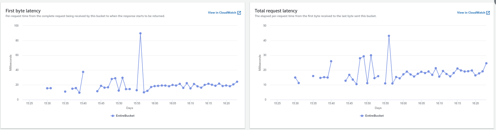
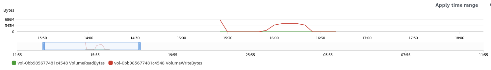

# EMR Testing Notes
- [EMR Testing Notes](#emr-testing-notes)
- [About](#about)
  - [The use case](#the-use-case)
  - [Resources worth looking at.](#resources-worth-looking-at)
  - [Provisioning](#provisioning)
  - [Things I wanted to figure out:](#things-i-wanted-to-figure-out)
    - [EBS Mounts](#ebs-mounts)
    - [S3 access patterns.](#s3-access-patterns)
    - [Caching](#caching)
      - [HDFS Service Level Caching](#hdfs-service-level-caching)
      - [HBASE](#hbase)
        - [BlockCache](#blockcache)
        - [BucketCache](#bucketcache)
  - [Testing](#testing)
    - [Initial test](#initial-test)
      - [S3 access patterns](#s3-access-patterns-1)
      - [EBS access](#ebs-access)
    - [Second test:](#second-test)
    - [Third test: What write load will throttle](#third-test-what-write-load-will-throttle)


# About

This repo is a bit of an ongoing thing so expect a lot of #TODOS and ramblings that need to be cleaned up before I'm happy with things.

I've ran into an issue where I've got a few unknowns about using EMR for my specific use case, so this is my attempt to write down things as I find them for
1. My own memory
2. [This](https://youtu.be/-MUhcgXBj_A?t=672)

I've found a few things that are a bit unclear about EMR for my specific use case so I'm going to write down things as I find them.


## The use case
My intended use case is to replace a time-series database, [OpenTSDB](http://opentsdb.net) running on EMR using S3FS backing instead of HDFS.

In practical terms, this means the workloads are generally very write-heavy, read-light, with the majority of the data being read is fairly recent, however infrequent long-running queries that pull a lot of data are very possible and expected.


## Resources worth looking at.
The best resource I've found so far on some of the more prickly optimisations is the [Migrating to Apache Hbase on Amazon S3 on Amazon EMR](https://d1.awsstatic.com/whitepapers/Migrating_to_Apache_Hbase_on_Amazon_S3_on_Amazon_EMR.pdf) document.

Clouderas documentation for HBase tens to be pretty good, I used a lot of the [HBase documentation](https://docs.cloudera.com/documentation/enterprise/6/6.3/topics/admin_hbase_blockcache_configure.html) for understanding.

The [Hbase](https://hbase.apache.org/book.html) book was also very useful

## Provisioning
I've included Cloudformation scripts to spin up the nodes that I used to test. You can ssh into the node and localforward any traffic that you needed out. The cloudformation scripts generates a keypair, use `aws ssm get-parameter --name /ec2/keypair/{KEYNAME} --region ap-southeast-1 --with-decryption` to access and make sure to ``chmod 600`` the keyfile if you get incorrect permission issues.

I have a tendency to only enable SSH access and just localforward any pages I need out, for information on SSH local forwarding I usually point people to [this stackoverflow answer](https://unix.stackexchange.com/a/115906).


## Things I wanted to figure out:

### EBS Mounts
It's easy to set an EBS on an instance group, there doesn't seem to be any way to set a mount point with cloudformation. For my own reference:
```
CoreInstanceGroup:
    InstanceCount: !Ref CoreNodeCount
    InstanceType: m5.xlarge
    Market: ON_DEMAND
    Name: Core
    EbsConfiguration:
    EbsBlockDeviceConfigs:
    - VolumeSpecification:
        SizeInGB: 25
        VolumeType: gp2
        VolumesPerInstance: 1
```

EMR with one volume mounted (22GB)
```
[ec2-user@ip-10-1-0-141 dev]$ sudo lsblk
NAME          MAJ:MIN RM SIZE RO TYPE MOUNTPOINT
nvme1n1       259:0    0  22G  0 disk 
├─nvme1n1p1   259:4    0   5G  0 part /emr
└─nvme1n1p2   259:5    0  17G  0 part /mnt
nvme0n1       259:1    0  20G  0 disk 
├─nvme0n1p1   259:2    0  20G  0 part /
└─nvme0n1p128 259:3    0   1M  0 part 
```


EMR with two volumes mounted (25GB and 30GB)
```
[ec2-user@ip-10-1-0-172 mnt]$ sudo lsblk
NAME          MAJ:MIN RM SIZE RO TYPE MOUNTPOINT
nvme1n1       259:0    0  25G  0 disk 
├─nvme1n1p1   259:5    0   5G  0 part /emr
└─nvme1n1p2   259:6    0  20G  0 part /mnt
nvme2n1       259:1    0  30G  0 disk /mnt1
nvme0n1       259:2    0  20G  0 disk 
├─nvme0n1p1   259:3    0  20G  0 part /
└─nvme0n1p128 259:4    0   1M  0 part 
```

It looks like the first 5GB you provision goes to `/emr`, with the rest of the first drive going to `/mnt`, and any further EBS volumes going to `/mnt{number}`.

These directories will become important when I start talking about caching, since you probably want to avoid setting up a huge cache on your root volume, as this seems like a pretty bad idea for a bunch of reasons.


### S3 access patterns.
There there is a [tangible cost to S3 actions](https://aws.amazon.com/s3/pricing/) and while these are fractions of a cent per 1000 requests, when you start scaling up to lots of writes/reads per second, you probably want to understand access patterns.

In my write heavy environment, using one of my 200k writes/s as an example, S3 doesn't actually try to do 200k S3 actions/s, and the reason for this can be best explained by the write path.
.

Ref: [Clouderas blog](https://blog.cloudera.com/apache-hbase-write-path/#:~:text=The%20write%20path%20is%20how,data%20file%20called%20an%20HFile.)

Along with the role of [Minor and Major HBase compactions](https://stackoverflow.com/a/63657668) in this process.

Essentially all this boils down to:
1. The WALs will be written to EBS, so they won't show up as S3 actions.
2. The Memstore will periodically flushed to disk, and these will show up as S3 PUTs as they will write small files to the region.
3. Fairly frequently these small files will be merged into the main HFile for the region. This is the Minor Compaction process. Access pattern wise, in addition to the PUTs you'd expect to see when flushing the memstore, you'll see a lot of GET, HEAD and DELETE requests from this compaction process.
4. Less frequently (And commonly accepted wisdom is to disable them and run them at specific off peak times) Major compactions will run across an entire column family rather than a single region. Expect the traffic and S3 requests to spike during this period.

### Caching

Caching is good for performance, but it's also going to be good for your wallet, as if you're doing S3 GETs each time you need some data, it's going to be expensive fast. The various services involved have a few different options:

#### HDFS Service Level Caching

For some confusion: Even if you don't explicitly set/tick "HDFS" (Hadoop Distributed File System) when you spin up a HBase instance, the service itself will still run, as the file system used when using S3 (EMRFS) relies on the service, but replaces the backend that's normally the Hadoop Distributed File System backend with S3 as a filesystem. When I talk about HDFS here, I'm not talking about the File System, but the Service that provided EMRFS.

Native HDFS has the concept of a [Block Storage Policies](https://hadoop.apache.org/docs/stable/hadoop-project-dist/hadoop-hdfs/ArchivalStorage.html) that allows you to set different storage tiers for Hot/Cold/Warm access.

Running ``` hdfs storagepolicies -listpolicies` shows the policies, but investigating the logfiles for the service shows that this won't work as EMRFS doesn't support it.

```
CommonFSUtils: Unable to set storagePolicy=HOT for path=s3://BUCKETNAMEREDACTED/my-hbase-rootdir/MasterData/data/master/store/1595e783b53d99cd5eef43b6debb2682/proc. DEBUG log level might have more details.
java.lang.UnsupportedOperationException: EmrFileSystem doesn't support setStoragePolicy
	at org.apache.hadoop.fs.FileSystem.setStoragePolicy(FileSystem.java:3163)
```

This isn't really an issue though, as HBase has other options for Caching.

#### HBASE
##### BlockCache
BlockCache uses an in memory LRUCache and shows up in HBase as the level 1 Cache. #todo Image.


You've got two main settings that control the size of this, and a lot of other settings that control the split for this.
1. `hfile.block.cache.size`, which is the proportion of the JVM heap to allocate to the block cache
2. JVM size. You generally use -Xmx to set the max heap size as a flag when starting Hbase. Anecdotally I find setting this >30GB is a bad idea because it can cause JVM Garbage collection pauses to take too long. This isn't really documented very well, and the [blog first introducing it](https://aws.amazon.com/blogs/aws/new-elastic-mapreduce-feature-bootstrap-actions/) gives the wrong address, but `s3://elasticmapreduce/bootstrap-actions/configure-hbase` with the arg `-hbase-regionserver-opts=-Xmx{size}` should do the job.

For #2, the bootstrap script is just adding the values to your HBase env file, so if you want to see if it worked, look there.

##### BucketCache
The [BucketCache](https://docs.cloudera.com/runtime/7.2.10/configuring-hbase/topics/hbase-offheap-bucketcache.html) can be used as a second layer of caching. The advantage of BucketCache is that you can set the ```hbase.bucketcache.ioengine``` to be either off heap memory or file. 

It's worth pointing out the latencies involved in the components here,
* The highest EBS read latency that I saw during testing was 10ms, nominal was normally around 1ms.
* S3 access latency was generally 100ms.
* In memory caching ends up being a LOT faster than any of these.

Remembering that there's already going to be some in memory LRU caching happening as part of the BlockCache, I didn't really see the need to provision high memory instances and throw BucketCache in memory. Instead I went with the much cheaper option of using EBS storage (`~10C USD GB/Month`) on the core nodes (Region Servers).

The setup of this was pretty basic, the first EBS volume you provision will mount all but 5GB to /mnt (More on this later), so I had a bootstrap action to create the /bucketcache directory and make sure it was readable and writable by users.

```config
"hbase.bucketcache.combinedcache.enabled": "true"
"hbase.bucketcache.ioengine": "file:/mnt/bucketcache/cachefile"
"hbase.bucketcache.size": "20000"
```

To go one step further, the [Migrating to Apache Hbase on Amazon S3 on Amazon EMR](https://d1.awsstatic.com/whitepapers/Migrating_to_Apache_Hbase_on_Amazon_S3_on_Amazon_EMR.pdf) document suggests pre fetching blocks. The relevant setting is `hbase.rs.prefetchblocksonopen` is the setting, and `PREFETCH_BLOCKS_ON_OPEN` needs to be set to true on the column family.

There's a few other options (including some that require modifications to the HBase column family to be fully effective). You'd probably want to investigate at the very least `hbase.rs.cacheblocksonwrite` as far as HBase settings go, although [The Whitepaper](https://d1.awsstatic.com/whitepapers/Migrating_to_Apache_Hbase_on_Amazon_S3_on_Amazon_EMR.pdf) has more info around these.

You'd probably want to investigate column family level settings, eg `IN_MEMORY` which changes priorities when it comes to cache evictions, and some more self-explanatory settings `CACHE_DATA_ON_WRITE` `CACHE_INDEX_ON_WRITE` `CACHE_BLOOMS_ON_WRITE` `CACHE_DATA_IN_L1`.


## Testing
The initial test I ran was very adhoc, and the data from it was mostly "what can I get" instead of doing a rigorous test. My intent is to properly pipeline them with an EMR Cluster + Dedicated EC2 running OpenTSDB writing to it.

Currently I used the `networks.yml` and `emr.yml` to boostrap the network and server, then just ran the OpenTSDB instance on the master node. On retrospect, this was a poor idea because I saw the CPU of the master node go pretty high.


At some point I'll do some explicit tests on getting data rather than inserting, but I'll need to think more about how to do that so for now that's a TODO.

### Initial test
OpenTSDB with a single master and regionserver. 

All diagrams are #TODO until I set up proper pipelines for tests and run them for a bit longer.


I was using [opentsdb load generator](https://github.com/staticmukesh/opentsdb-load-generator) running at 250k metrics/s over 10 threads.

There were no changes to the default [create_table.sh](https://github.com/OpenTSDB/opentsdb/blob/master/src/create_table.sh), which means no pre splitting regions, default LZO compression and no caching on write for the UID table, which means some GETS are expected.

The changes I made from the default OpenTSDB configs beyond the zookeeper servers:
```config
tsd.core.auto_create_metrics = true
tsd.storage.fix_duplicates = true
```

#### S3 access patterns
The test started ~14:00, and it's pretty clear that there's a reasonably predictable set of access patterns.




#TODO single dashboard that shows all metrics for S3 that I care about

#### EBS access

It's hard to tell whether this is Caching or WAL, but it's sure being used.


#TODO Regionserver dashboard showing writes, IOPS, Read/Write latencies.


### Second test:
a #todo

Same 200k reqs/s, still a single regionserver but presplit table and enable UID randomisation to distribute load.

What I want to do there is show how S3 behaviour changes as the number of active regions changes.


### Third test: What write load will throttle
a #TODO of what I plan to do.

Ad hoc testing showed a sustained 250k write/s was reasonable, 500k writes/s started getting IPC throttled. Does it scale so that 2 nodes = 500K is fine?